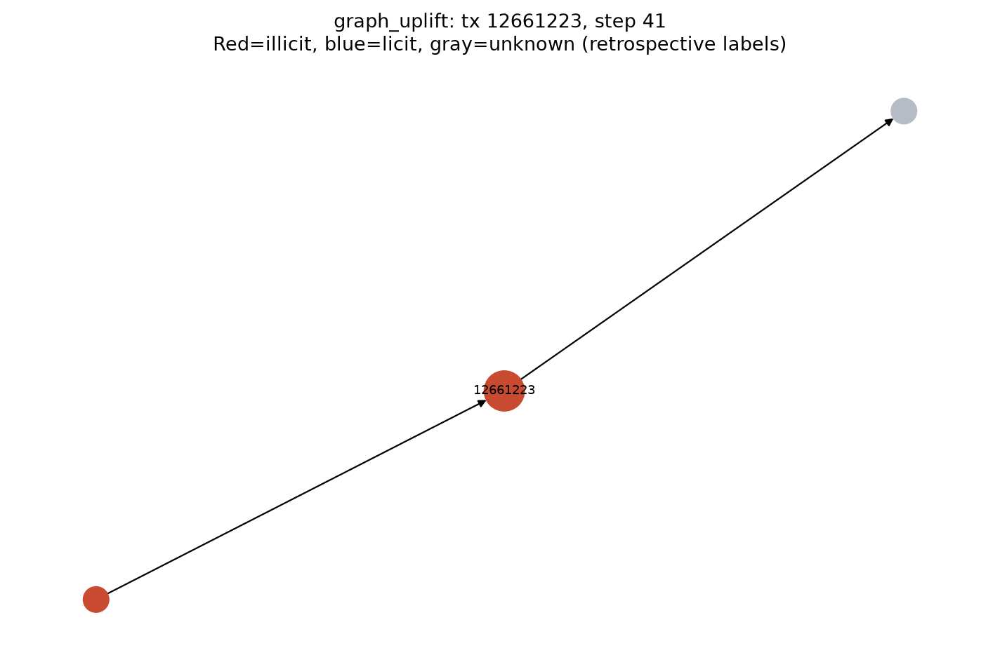
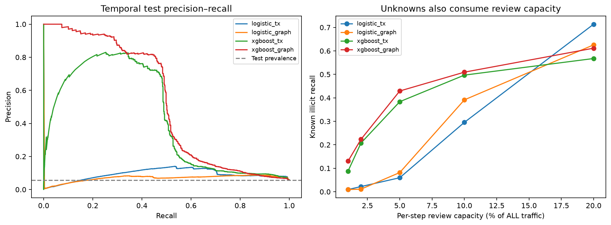
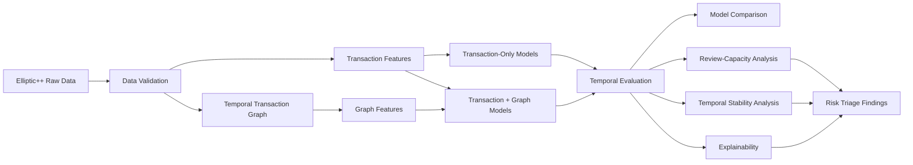
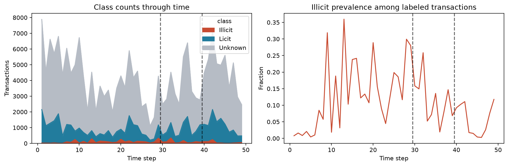
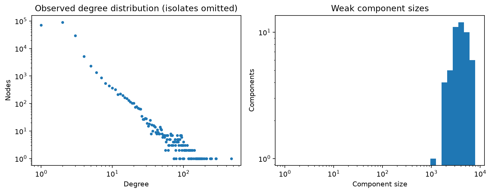
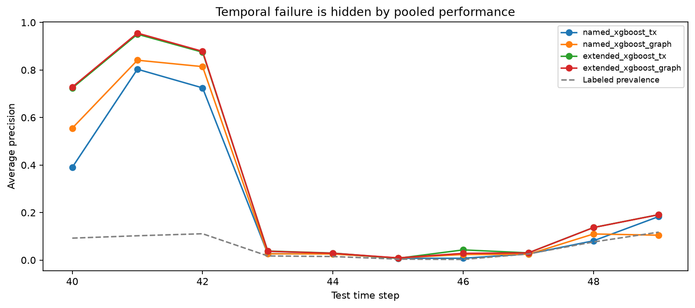
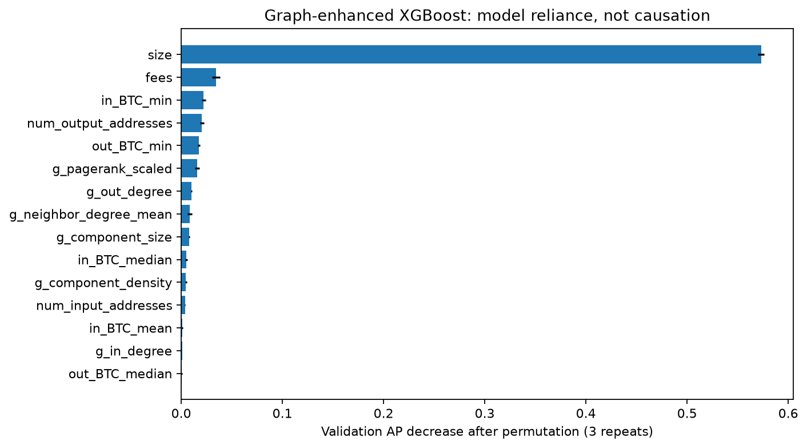

# FraudGraph

## Can transaction relationships reveal risk that individual transactions miss?

FraudGraph is a temporal machine-learning study of the **Elliptic++ Bitcoin transaction network**.

It began from a fairly simple curiosity: Bitcoin is often discussed in stories about scams, stolen funds and illicit finance, but the underlying transaction ledger is public. Bitcoin is therefore not "invisible" or literally untraceable — transactions can be observed on the blockchain — while the addresses involved are **pseudonymous** and do not automatically tell us who a real person is.

That creates an interesting analytical question:

> **If a single transaction does not tell us enough, can the pattern of transactions around it provide additional risk signal?**

This project tests that idea with real network data and then pushes the question further: even if network features help a machine-learning model, do they help enough to improve **human analyst prioritization**, and do they remain reliable as transaction behavior changes over time?

---

## Why I built this

I initially considered building a more conventional customer or e-commerce fraud project. The problem was data quality: realistic customer-level financial behavior is difficult to obtain publicly because it is sensitive, and many easily accessible portfolio datasets are synthetic or heavily simplified.

I wanted to work with something real.

Elliptic++ gave me a harder but much more interesting alternative: a real Bitcoin transaction graph with **203,769 transactions**, **234,355 directed money-flow relationships**, and labels for a subset of transactions.

I was already becoming interested in networks — how transactions, customers, firms or accounts can be understood not only as rows in a table but as **connected systems**. FraudGraph became my way of learning that idea by asking a practical risk question rather than building a graph simply because graph tools were available.

The project therefore became a comparison between two ways of looking at the same transaction:

- **Transaction view:** What are the characteristics of this transaction itself?
- **Network view:** Where does this transaction sit in the surrounding flow of money, and what does its local structure look like?

---

# If you do not work with Bitcoin or graphs, start here

Think of a normal machine-learning dataset as a spreadsheet:

| Transaction | Amount | Fee | Size | Inputs | Outputs |
|---|---:|---:|---:|---:|---:|
| A | ... | ... | ... | ... | ... |
| B | ... | ... | ... | ... | ... |

That tells us about **A** and **B individually**.

A transaction network adds the relationships:

~~~mermaid
flowchart LR
    A[Transaction A] --> B[Transaction B]
    C[Transaction C] --> B
    B --> D[Transaction D]
    B --> E[Transaction E]
~~~

In FraudGraph:

| Graph concept | Meaning in this project |
|---|---|
| **Node** | A Bitcoin transaction |
| **Directed edge** | A transaction-to-transaction money-flow relationship |
| **Transaction features** | Amounts, fees, size, address counts and related attributes |
| **Graph features** | Degree, PageRank, neighborhood structure and connected-component properties |
| **Known label** | Illicit or licit where Elliptic++ provides ground truth |
| **Unknown** | No known class label; never silently treated as legitimate |

The central experiment asks whether adding the second view — **network context** — improves risk ranking beyond the transaction attributes alone.

> **Terminology note:** despite the repository name, the Elliptic++ target is **illicit vs. licit transactions**. The project does not claim that every illicit label is equivalent to confirmed customer fraud, legal guilt or a measured financial loss.

---

# See the network before the metrics

## A transaction whose score changed when network context was added

<p align="center">
  
</p>

This is a bounded **one-hop neighborhood** around a known illicit test transaction.

- **Red** = known illicit
- **Blue** = known licit
- **Gray** = unknown label
- **Arrows** = directed transaction relationships
- the larger labeled center node is the transaction being explained

For this case, the transaction-only XGBoost model assigned a score of **0.2992**. After network features were added, the score increased to **0.6890**.

That does not prove the surrounding network *caused* illicit behavior. It simply shows why the project became interesting: **the relationships changed what the model inferred from the same transaction.**

---

## The core model-and-operations view

<p align="center">
  
</p>

The left side compares **precision and recall** on the chronological test set. The right side asks a more operational question:

> **If analysts can review only the highest-risk 1%, 2%, 5%, 10% or 20% of transaction traffic, how much known illicit activity do they actually surface?**

That second chart matters because a fraud or financial-crime team does not experience a model as an AP score. It experiences **queues, investigation capacity, false positives and missed cases**.

---

# The project in four numbers

| Result | Why it matters |
|---|---|
| **0.4239 → 0.5240 AP** | Graph context materially improved the primary XGBoost experiment |
| **+0.0049 AP** with 93 extra local features | The incremental value of the graph almost disappeared when richer transaction information was already available |
| **42.9%** known-illicit recall at a 5% review budget | Connects model ranking to analyst capacity |
| **0.7070 → 0.0257 AP** across early vs. later test periods | Strong pooled performance hid severe temporal instability |

So the project is not a simple "graph features win" story.

> **Network information can add useful signal, but its value depends on what transaction information already exists, what model uses it, what analysts can review, and whether the learned patterns remain stable over time.**

---
# Project at a glance

|                       |                                                                          |
| --------------------- | ------------------------------------------------------------------------ |
| **Problem**           | Prioritize suspicious transactions under limited analyst review capacity |
| **Dataset**           | Elliptic++ Bitcoin transaction graph                                     |
| **Transactions**      | 203,769                                                                  |
| **Directed edges**    | 234,355                                                                  |
| **Time steps**        | 49                                                                       |
| **Known illicit**     | 4,545                                                                    |
| **Known licit**       | 42,019                                                                   |
| **Unknown labels**    | 157,205                                                                  |
| **Models**            | Logistic Regression, XGBoost                                             |
| **Graph tooling**     | NetworkX                                                                 |
| **Primary metric**    | Average Precision                                                        |
| **Validation design** | Chronological train → validation → test                                  |
| **Decision analysis** | Per-time-step analyst review capacity                                    |
| **Explainability**    | Permutation Importance + TreeSHAP                                        |
| **SQL**               | SQLite analytical queries + PostgreSQL-compatible schema                 |
| **Testing**           | pytest                                                                   |

---

# Questions this project answers

FraudGraph was designed around five specific questions:

### 1. Does graph context improve illicit-transaction ranking when only interpretable transaction attributes are available?

### 2. Does that improvement remain when the model already has a much richer transaction-level feature set?

### 3. Under a fixed analyst review budget, how much known illicit activity can the selected model surface?

### 4. Does model performance remain stable when evaluated on later transaction periods?

### 5. Which transaction and network characteristics are associated with the model's predictions?

These questions separate **model performance**, **incremental value**, **operational usefulness**, and **generalization** rather than treating them as the same problem.

---

# System overview



The goal is not to build an automatic blocking system.

The project studies whether transaction-network information improves **batch risk prioritization for human analysts**.

---

# 1. Business problem

Fraud and risk teams rarely have enough investigators to manually inspect every transaction.

That creates a ranking problem.

A useful model must help answer:

> **Which transactions should analysts investigate first?**

This creates competing objectives.

The system should:

* surface as much illicit activity as possible
* avoid overwhelming analysts with unnecessary reviews
* account for transactions whose ground truth is unknown
* remain useful when transaction patterns change over time

That last point is especially important.

A model can produce a strong average test metric and still fail badly when used on later transaction populations.

FraudGraph explicitly tests for that failure.

---

# 2. Dataset

The project uses the transaction portion of **Elliptic++**, a Bitcoin financial-forensics dataset.

The working graph contains:

| Class     | Transactions |    Share |
| --------- | -----------: | -------: |
| Illicit   |        4,545 |     2.2% |
| Licit     |       42,019 |    20.6% |
| Unknown   |      157,205 |    77.1% |
| **Total** |  **203,769** | **100%** |

There are also:

**234,355 directed transaction-to-transaction edges**

across:

**49 chronological time steps**

Unknown transactions remain unknown.

They are **not converted into negative training examples**, because doing so would incorrectly assume that an unlabeled transaction is legitimate.

<p align="center">
  
</p>

<p align="center">
  <em>Transaction class counts and illicit prevalence over time. Dashed boundaries indicate the chronological train, validation, and test regions.</em>
</p>

---

## Graph structure

The transaction graph is sparse and highly uneven.

The observed network contains:

| Graph property              |   Value |
| --------------------------- | ------: |
| Nodes                       | 203,769 |
| Directed edges              | 234,355 |
| Weakly connected components |      49 |
| Isolated nodes              |       0 |
| Median total degree         |       2 |
| 95th percentile degree      |       4 |
| 99th percentile degree      |      13 |
| Maximum degree              |     473 |
| Largest weak component      |   7,880 |

<p align="center">
  
</p>

<p align="center">
  <em>Observed degree distribution and weakly connected-component sizes.</em>
</p>

This structure motivates the central hypothesis:

> A transaction's position and local relationships may contain information that is not represented by its transaction attributes alone.

---

# 3. Data validation

Before modeling, the raw files are checked for structural problems.

| Validation check                                      |  Result |
| ----------------------------------------------------- | ------: |
| Duplicate transaction IDs                             |       0 |
| Duplicate edges                                       |       0 |
| Self-loops                                            |       0 |
| Dangling edge endpoints                               |       0 |
| Directed edges                                        | 234,355 |
| Edges occurring outside their transaction time bucket |       0 |

A subset of rows has missing source attributes. Missing model inputs are handled using **training-only median imputation**.

The raw dataset is downloaded from the Elliptic++ authors' repository rather than redistributed in this project.

The downloader also verifies the expected raw files against recorded SHA-256 hashes.

See:

[`reports/data_validation.json`](reports/data_validation.json)

for the complete validation record.

---

# 4. Temporal experiment design

A random train/test split would allow transactions from later periods to influence a model evaluated on earlier periods.

That would not represent the intended use case.

FraudGraph therefore uses a chronological split:

| Split      | Time steps | Illicit |  Licit | Unknown |
| ---------- | ---------: | ------: | -----: | ------: |
| Train      |       1–29 |   2,871 | 23,510 |  94,423 |
| Validation |      30–39 |   1,038 |  7,961 |  27,319 |
| Test       |      40–49 |     636 | 10,548 |  35,463 |

The flow is therefore:

```text
PAST                                             FUTURE

Steps 1 ───────── 29    30 ───────── 39    40 ───────── 49
       TRAIN              VALIDATION              TEST
```

Training data is used to fit the models.

Validation data is used for:

* model comparison
* threshold selection
* analyst-policy selection

The test set is reserved for final evaluation.

**Test performance never selects model settings or thresholds.**

---

# 5. Leakage control

Graph-based financial modeling creates additional leakage risks because relationships can indirectly expose information about future transactions.

FraudGraph therefore builds graph snapshots using only transactions and edges observable by the relevant time cutoff.

### Controls used

| Potential leakage source        | Control                                   |
| ------------------------------- | ----------------------------------------- |
| Future transactions             | Chronological train/validation/test split |
| Future graph relationships      | Time-filtered graph snapshots             |
| Label leakage through neighbors | No label-derived neighbor features        |
| IDs memorized by model          | Transaction ID excluded                   |
| Time directly memorized         | Time index excluded                       |
| Scaling/imputation leakage      | Fit on training data only                 |
| Threshold tuning on test data   | Thresholds frozen using validation only   |
| Unknown labels treated as licit | Unknowns excluded from supervised fitting |

The scoring design represents **batch scoring at the close of a time bucket**, not an instantaneous streaming fraud system.

That distinction matters because same-period graph relationships are observable in this experiment.

For the full methodology:

[`reports/LEAKAGE_AUDIT.md`](reports/LEAKAGE_AUDIT.md)

---

# 6. Feature design

Two different feature families are evaluated.

## A. Named transaction features

The primary experiment uses **15 interpretable transaction attributes**, including:

| Category          | Examples                                  |
| ----------------- | ----------------------------------------- |
| Transaction scale | `total_BTC`, transaction `size`           |
| Cost              | `fees`                                    |
| Address activity  | number of input/output addresses          |
| Incoming value    | minimum, maximum, mean, median, total BTC |
| Outgoing value    | minimum, maximum, mean, median, total BTC |

These form the cleanest and most auditable baseline.

---

## B. Graph features

Eight features are engineered from the observable transaction network:

| Graph feature            | Interpretation                               |
| ------------------------ | -------------------------------------------- |
| `g_in_degree`            | Number of incoming transaction relationships |
| `g_out_degree`           | Number of outgoing relationships             |
| `g_total_degree`         | Overall connectivity                         |
| `g_pagerank_scaled`      | Relative network importance                  |
| `g_neighbor_degree_mean` | Connectivity of nearby transactions          |
| `g_component_size`       | Size of the surrounding network component    |
| `g_component_density`    | Connectivity density of that component       |
| `g_reciprocal_fraction`  | Reciprocal local network structure           |

The primary experiment therefore compares:

```text
Transaction features
        vs.
Transaction features + network context
```

---

## C. Extended sensitivity features

Elliptic++ also provides **93 anonymized local features**.

These are evaluated separately.

Why separate them?

Because their underlying meaning and extraction process are less interpretable than the named transaction attributes.

They provide a useful stronger baseline, but treating them as equivalent to fully understood production features would overstate what is known about them.

The extended experiment therefore asks:

> **Does graph context still add much information once the model already receives a very rich local representation?**

---

# 7. Models

Two model families are deliberately compared.

### Logistic Regression

Provides a relatively simple linear baseline.

### XGBoost

Provides a nonlinear boosted-tree model capable of learning interactions among transaction and graph characteristics.

The experiment does **not** require:

* a Graph Neural Network
* a GPU
* Neo4j
* a distributed computing environment

That keeps the experiment reproducible on ordinary hardware while still testing whether network-derived information adds value.

---

# 8. Evaluation metric

## Why Average Precision?

Accuracy would be misleading here because illicit transactions are rare.

A model could classify most transactions as non-illicit and achieve high accuracy while being nearly useless to analysts.

The primary ranking metric is therefore **Average Precision (AP)**, the non-interpolated summary of the precision-recall curve.

This is appropriate because the main question is:

> **Can the model rank known illicit transactions ahead of non-illicit ones?**

Precision, recall, false-positive rate, review-capacity performance, and temporal performance are also reported.

---

# 9. Question 1 — Does graph context improve ranking when only interpretable transaction attributes are available?

This is the primary experiment.

| Model               | Transaction-only AP | + Graph AP |  Difference |
| ------------------- | ------------------: | ---------: | ----------: |
| Logistic Regression |              0.0906 |     0.0696 |     -0.0210 |
| **XGBoost**         |          **0.4239** | **0.5240** | **+0.1000** |

For XGBoost:

## `0.4239 → 0.5240 AP`

Adding graph information produces a **+0.1000 absolute AP improvement**.

The graph features do not improve Logistic Regression, however.

That means the result is not:

> Graph features always improve the model.

It is more specific:

> **The additional network information is useful to the nonlinear XGBoost model, but not to the linear baseline.**

## Uncertainty around the improvement

The graph-vs-transaction AP difference was also evaluated using a paired bootstrap over **time buckets**, rather than treating individual transactions as independent observations.

For the primary XGBoost comparison:

| Statistic                     |                Value |
| ----------------------------- | -------------------: |
| AP difference                 |              +0.1000 |
| 95% paired bootstrap interval | **[0.0015, 0.1365]** |
| Resamples                     |                1,000 |
| Resampling unit               |          Time bucket |

Only ten test buckets are available, so these uncertainty estimates should still be interpreted cautiously.

---

# 10. Question 2 — Does graph context still help when much richer transaction information is available?

The same comparison is repeated after adding the **93 anonymized local features**.

| Feature family                | Transaction XGBoost | + Graph XGBoost |  Graph gain |
| ----------------------------- | ------------------: | --------------: | ----------: |
| 15 named features             |              0.4239 |      **0.5240** | **+0.1000** |
| Named + 93 anonymous features |              0.6349 |      **0.6398** | **+0.0049** |

The graph contribution becomes dramatically smaller.

The paired bootstrap interval for the extended XGBoost difference is:

**[-0.0008, 0.0115]**

which includes zero.

### Interpretation

This suggests that graph structure is particularly useful when the available transaction-level representation is relatively limited.

When a strong local representation already exists, much of that information may overlap with what the graph features contribute.

This is one of the central findings of the project.

---

# 11. Question 3 — What happens when analyst capacity is limited?

A good model metric does not automatically create a useful risk system.

Analyst teams have limited investigation capacity.

FraudGraph therefore evaluates a policy that ranks transactions **within each time period** and sends only the top-scoring fraction for review.

Unknown transactions also consume capacity.

This matters because an analyst does not know which unknown transactions will eventually prove licit or illicit.

For the selected primary graph-XGBoost model:

| Review capacity |  Reviewed | Known illicit | Known licit |   Unknown | Known illicit recall |
| --------------: | --------: | ------------: | ----------: | --------: | -------------------: |
|              1% |       471 |            83 |          18 |       370 |                13.1% |
|              2% |       938 |           142 |          52 |       744 |                22.3% |
|          **5%** | **2,337** |       **273** |     **140** | **1,924** |            **42.9%** |
|             10% |     4,670 |           324 |         530 |     3,816 |                50.9% |
|             20% |     9,333 |           389 |       1,427 |     7,517 |                61.2% |

### At a 5% review capacity:

**2,337 transactions are reviewed**

and:

**273 of the 636 known illicit test transactions are surfaced**

giving:

## **42.9% known-illicit recall**

But 1,924 reviewed transactions have unknown labels.

Because their true outcomes are unavailable, population-wide precision and recall cannot be identified exactly.

The project therefore avoids pretending that unknown transactions are legitimate.

---

## Why this analysis matters

Suppose two models have similar AP.

One might concentrate illicit transactions near the very top of its ranking while another distributes them more broadly.

For a team capable of reviewing only 5% of traffic, those models can have very different operational value.

That is why FraudGraph evaluates both:

**machine-learning performance**

and:

**decision performance under constrained review capacity.**

---

# 12. Score bands vs fixed-capacity review

The project explores two different decision policies.

They should not be confused.

## Fixed score bands

Validation-derived score thresholds create:

* **LOW** — no escalation from this model
* **REVIEW** — routine analyst investigation
* **HIGH** — prioritized analyst investigation

These thresholds represent consistent score evidence but do not guarantee a fixed workload when future score distributions change.

The resulting REVIEW interval became extremely narrow on the test population, demonstrating that the proposed three-band policy did not transfer cleanly.

That result is retained rather than hidden.

---

## Per-time-step Top-K policy

The capacity analysis instead takes the top:

**1%, 2%, 5%, 10%, or 20%**

of each time period's traffic.

This enforces a predictable analyst workload, but the effective score threshold can change over time.

In a real organization, choosing between these approaches would depend on:

* analyst staffing
* investigation cost
* expected fraud loss
* score calibration
* label maturation
* customer-friction constraints

FraudGraph does not have those business inputs, so it does not claim to have identified an economically optimal threshold.

See:

[`reports/DECISION_FRAMEWORK.md`](reports/DECISION_FRAMEWORK.md)

---

# 13. Question 4 — Does the model remain reliable over time?

This is the most important negative result in the project.

Looking only at pooled test performance hides severe instability.

<p align="center">
  
</p>

<p align="center">
  <em>Average Precision by test time step. Strong pooled results hide severe deterioration in later periods.</em>
</p>

For the primary graph-enhanced XGBoost model:

| Test period | Average Precision |
| ----------- | ----------------: |
| Steps 40–43 |        **0.7070** |
| Steps 44–49 |        **0.0257** |

The later-period illicit prevalence is approximately:

**0.0273**

The extended boosted models also deteriorate.

### Conclusion

> **The model does not generalize reliably across the full future test period.**

This blocks any claim that the current model is ready for stable production deployment.

---

## What caused the decline?

The dataset does not establish the cause.

Possible explanations include:

* changes in transaction behavior
* changes in population composition
* differences in labeling
* structural changes in the observed network
* broader distribution shift

These are **hypotheses**, not established explanations.

A production system would require ongoing drift monitoring and prospective validation.

---

# 14. Question 5 — What information is the model using?

Permutation importance is evaluated on validation data to estimate how much model performance changes when individual features are disrupted.

<p align="center">
  
</p>

<p align="center">
  <em>Permutation importance for the selected graph-enhanced XGBoost model.</em>
</p>

The dominant feature is:

**transaction size**

Several graph variables also provide measurable signal, including:

* scaled PageRank
* outgoing degree
* average neighbor degree
* component size
* component density

This suggests that the model primarily relies on transaction characteristics while also extracting useful information from local network structure.

These feature relationships are **associative**, not causal.

They do not imply that network connectivity causes illicit activity.

---

# 15. Individual network cases

Global model metrics do not show what an individual graph-based prediction looks like.

FraudGraph therefore generates deterministic network case studies.

The cases include:

| Case                                     | Transaction | Step | Known class | Graph score | Transaction-only score |
| ---------------------------------------- | ----------: | ---: | ----------- | ----------: | ---------------------: |
| Highest-scoring known illicit            |    12662327 |   41 | Illicit     |      0.9839 |                 0.8936 |
| Highest-scoring known licit              |    72687354 |   42 | Licit       |      0.9559 |                 0.9068 |
| Largest graph uplift among known illicit |    12661223 |   41 | Illicit     |  **0.6890** |             **0.2992** |

The final case is particularly useful because network context raises the model score from:

**0.2992 → 0.6890**

Interactive Plotly versions are also generated for exploration.

These are bounded case viewers, not a complete graph-exploration product.

---

# 16. Robustness checks

Several additional checks were performed after the main experiment.

Examples include:

* paired time-bucket bootstrap uncertainty analysis
* shuffled-label negative control
* degree-only graph model
* graph-feature ablations
* removing potential named-feature fingerprints
* evaluating models separately by time period

For example:

* removing named-feature fingerprints leaves graph XGBoost AP approximately unchanged at **0.5241**
* degree-only XGBoost reaches **0.4683 AP**
* removing component features produces approximately **0.5057 AP**

These diagnostics help test whether the primary result depends entirely on one particular graph representation.

They do **not** overturn the temporal-generalization failure.

Detailed outputs are available in:

* `reports/robustness.csv`
* `reports/structural_ablations.csv`
* `reports/paired_comparison.json`
* `reports/test_by_time.csv`

---

# 17. SQL analysis

SQL is used as part of the analytical workflow rather than being included only as a technology label.

Queries cover tasks such as:

* time-period and class aggregation
* transaction-edge joins
* incoming-degree extraction
* risk summaries

Four analytical queries were executed using **SQLite**.

The independently calculated SQL incoming-degree values match the NetworkX results.

A PostgreSQL-compatible schema is also included for portability, although a PostgreSQL server is not required to reproduce the current experiment.

See the [`sql/`](sql/) directory.

---

# 18. Tools and technologies

| Area                | Tools                                                                           |
| ------------------- | ------------------------------------------------------------------------------- |
| Language            | Python 3.12                                                                     |
| Data manipulation   | pandas, NumPy                                                                   |
| Machine learning    | scikit-learn, XGBoost                                                           |
| Graph analytics     | NetworkX                                                                        |
| Explainability      | Permutation Importance, TreeSHAP                                                |
| Database / analysis | SQL, SQLite                                                                     |
| Visualization       | Matplotlib, Plotly                                                              |
| Testing             | pytest                                                                          |
| Reproducibility     | configuration-driven scripts, fixed random seed, persisted experiment artifacts |

The core study does **not** require a GPU.

---

# 19. Repository structure

```text
FraudGraph/
│
├── config.json
│
├── README.md
├── requirements.txt
├── requirements-lock.txt
├── pyproject.toml
│
├── src/
│   └── fraudgraph/
│       ├── data.py
│       ├── graph.py
│       ├── models.py
│       ├── evaluation.py
│       ├── pipeline.py
│       ├── diagnostics.py
│       └── visualization.py
│
├── notebooks/
│   └── 01...07
│
├── sql/
│   └── analytical queries and schema
│
├── tests/
│   └── methodology and regression tests
│
├── scripts/
│   ├── notebook execution
│   ├── reporting
│   └── artifact verification
│
├── reports/
│   ├── figures/
│   ├── results.csv
│   ├── test_by_time.csv
│   ├── review_capacity.csv
│   ├── robustness.csv
│   ├── structural_ablations.csv
│   └── methodology / audit documents
│
├── data/
│   ├── raw/
│   └── processed/
│
└── models/
```

Raw and processed data as well as fitted models are generated locally and are Git-ignored where appropriate.

---

# 20. Reproducing the project

## Requirements

The project was tested with:

**Python 3.12**

The raw source files total roughly **702 MB**.

Allow additional disk space for:

* the Python environment
* processed parquet files
* models
* generated reports
* figures

No GPU is required.

---

## 1. Clone the repository

```bash
git clone https://github.com/Thizisfranklin/FraudGraph.git
cd FraudGraph
```

---

## 2. Create a virtual environment

### Windows PowerShell

```powershell
python -m venv .venv
.\.venv\Scripts\Activate.ps1
```

### macOS / Linux

```bash
python -m venv .venv
source .venv/bin/activate
```

---

## 3. Install dependencies

```bash
python -m pip install --upgrade pip
python -m pip install -r requirements.txt
python -m pip install --no-deps -e .
```

`requirements.txt` contains the direct dependencies.

`requirements-lock.txt` captures the original complete environment for more exact reproduction.

---

## 4. Run the tests

```bash
python -m pytest -q
```

The current project test suite contains:

**15 passing tests**

covering critical methodology and regression behavior.

---

## 5. Download and run the main experiment

```bash
python -m fraudgraph.pipeline --download
```

This:

1. downloads the required Elliptic++ transaction files
2. validates the source files
3. builds the processed dataset
4. constructs temporal graph features
5. fits the prespecified models
6. evaluates validation and test performance
7. writes the primary analytical artifacts

After the raw files have been downloaded once, subsequent runs can omit the download flag when appropriate.

---

## 6. Run diagnostics

```bash
python -m fraudgraph.diagnostics
```

This executes the additional robustness and ablation analyses.

---

## 7. Build the notebooks and reports

```bash
python scripts/build_notebooks.py
python scripts/execute_notebooks.py
python scripts/build_reports.py
```

---

## 8. Verify generated artifacts

```bash
python scripts/verify_artifacts.py
```

This checks that the expected analytical outputs were successfully generated.

---

# 21. Configuration

Key experiment settings are stored in:

[`config.json`](config.json)

Current settings include:

```json
{
  "seed": 42,
  "train_end": 29,
  "validation_end": 39,
  "review_fraction": 0.05,
  "high_precision_target": 0.9,
  "high_min_cases": 20,
  "threads": 2,
  "bootstrap_repetitions": 1000
}
```

Keeping these values outside the modeling code makes the main experimental assumptions explicit and easier to reproduce.

---

# 22. Generated outputs

Important outputs include:

| Artifact                             | Purpose                                    |
| ------------------------------------ | ------------------------------------------ |
| `reports/results.csv`                | Main validation and test metrics           |
| `reports/test_by_time.csv`           | Performance by chronological test period   |
| `reports/review_capacity.csv`        | Analyst capacity simulations               |
| `reports/permutation_importance.csv` | Feature importance                         |
| `reports/cases.csv`                  | Selected network cases                     |
| `reports/paired_comparison.json`     | Paired bootstrap comparisons               |
| `reports/robustness.csv`             | Robustness analyses                        |
| `reports/structural_ablations.csv`   | Graph feature ablations                    |
| `reports/LEAKAGE_AUDIT.md`           | Leakage-control documentation              |
| `reports/DECISION_FRAMEWORK.md`      | Analyst decision policy                    |
| `VERIFIED_PORTFOLIO_CLAIMS.md`       | Verified project claims                    |
| `HANDOFF.md`                         | Complete methodology and interview handoff |

The repository therefore preserves not only final metrics, but also the evidence used to support them.

---

# 23. Limitations

FraudGraph is a rigorous offline study, but it is **not a production fraud-detection system**.

Important limitations include:

### Unknown labels

Most transactions have unknown ground truth.

This makes population-level precision and recall impossible to determine exactly.

### Temporal instability

The strongest models deteriorate substantially during later test periods.

This is the largest obstacle to deployment.

### Incomplete graph visibility

The observed transaction graph represents the relationships available in Elliptic++, not necessarily the full real-world financial network.

### Coarse time buckets

The experiment uses bucket-close graph information.

It is not a millisecond-by-millisecond online fraud simulation.

### No customer-level measurement

The dataset does not identify unique customer experiences in a way that supports claims about:

* customers incorrectly blocked
* customer retention
* customer lifetime value
* actual friction cost

### No monetary-loss labels

The study cannot estimate dollars of fraud prevented or financial return on deployment.

### No prospective production trial

All results are retrospective.

### No calibrated probability model

The model outputs ranking scores, not validated probabilities of criminal or fraudulent behavior.

### Anonymous source features

The 93 extended local features have limited interpretability, which is why they are treated as a sensitivity analysis rather than the main auditable feature family.

---

# 24. What would be required before deployment?

A real production extension would require additional work, including:

* prospective evaluation on new data
* drift detection and monitoring
* label-maturation tracking
* calibrated risk probabilities
* analyst investigation-cost estimates
* fraud-loss severity
* customer-friction measurement
* fairness and policy review
* wallet/entity-level evaluation
* real-time feature availability testing
* retraining and rollback policies

The current project establishes an experimental foundation for those questions rather than claiming they have already been solved.

---

# 25. Key findings

| Question                                                         | Evidence                                                 | Finding                                       |
| ---------------------------------------------------------------- | -------------------------------------------------------- | --------------------------------------------- |
| Does graph context help with interpretable transaction features? | XGBoost AP: 0.4239 → 0.5240                              | **Yes, materially in the primary experiment** |
| Does graph context help every model?                             | Logistic AP: 0.0906 → 0.0696                             | **No**                                        |
| Does graph context still help with 93 additional local features? | XGBoost AP: 0.6349 → 0.6398                              | **Only marginally**                           |
| Can the model prioritize limited analyst capacity?               | Top 5% captures 273/636 known illicit                    | **42.9% known-illicit recall**                |
| Are the results stable across future time periods?               | AP 0.7070 → 0.0257 across early vs later test cohorts    | **No**                                        |
| Is the system production-ready?                                  | Temporal failure + unknown labels + no prospective trial | **The evidence does not support that claim**  |

---

# Bottom line

FraudGraph began with a simple question:

> **Does knowing how transactions are connected help identify suspicious activity?**

The completed experiment gives a more useful answer.

> **Network context can materially improve illicit-transaction ranking when only a limited set of transaction attributes is available. That incremental advantage nearly disappears when much richer local information is present, and even the strongest models fail to remain reliable across later time periods.**

For a real risk team, that means graph analytics should not be evaluated in isolation.

Its value depends on:

**the information already available, the model using it, analyst review capacity, and whether the learned patterns remain stable as the transaction population changes.**

---

## Dataset citation

This project uses data from:

**Elmougy, Y. & Liu, L. (2023). *Demystifying Fraudulent Transactions and Illicit Nodes in the Bitcoin Network for Financial Forensics.***

Dataset source:

[Elliptic++ authors' repository](https://github.com/git-disl/EllipticPlusPlus)
