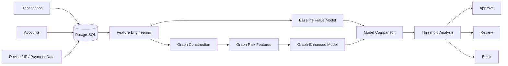

# FraudGraph — Graph Fraud & Risk Intelligence

> A fraud analytics project testing whether relationships between accounts, devices, IP addresses, payment instruments, and transactions can reveal coordinated fraud patterns that transaction-level models miss.

Fraud often looks harmless when transactions are examined individually. The same accounts may become suspicious once shared devices, IP addresses, or payment information reveal that they belong to a larger network.

FraudGraph asks:

> **Does network information improve fraud detection beyond traditional transaction-level models?**

The project also considers the cost of false positives, since catching fraud while constantly blocking legitimate customers is not a good risk system.

## Proposed System Flow

## Approach

### Baseline

Build traditional fraud models using transaction and account-level features.

### Graph Analysis

Represent accounts, devices, IP addresses, payment instruments, and transactions as a network and engineer signals such as shared entities, connected components, centrality, and suspicious clusters.

### Evaluation

Compare traditional and graph-enhanced models using metrics suited to fraud, including precision, recall, PR-AUC, false-positive rate, and fraud captured under limited review capacity.

### Decision Layer

Translate model scores into practical actions:

**Approve · Manual Review · Block**

## Tools

**Python · SQL · PostgreSQL · pandas · scikit-learn · XGBoost · NetworkX · Neo4j · Plotly**

## Results & Recommendation

> **To be completed after analysis.**

The final recommendation will determine whether graph information materially improves detection and where risk thresholds should be set.

## Limitations

The final project will consider class imbalance, graph leakage, changing fraud behavior, false positives, review capacity, and model drift.
