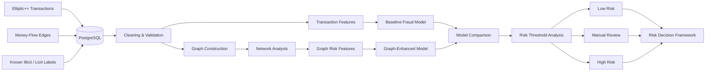

# FraudGraph — Graph Fraud & Risk Identifier 

> A fraud analytics project testing whether relationships between accounts, devices, IP addresses, payment instruments, and transactions can reveal coordinated fraud patterns that transaction-level models miss.


## Project Overview

Most traditional fraud models examine the characteristics of an individual transaction and ask:

> **Does this transaction look suspicious?**

That can work well when fraudulent behavior is obvious from the transaction itself.

The problem becomes more difficult when individual transactions appear normal but are connected to a larger pattern of suspicious activity.

FraudGraph explores whether those **relationships** provide information that a transaction-level model cannot see.

Using graph data from the Bitcoin network, the project will compare traditional machine-learning approaches with models enhanced by information about how transactions and wallet addresses are connected.

The central question is:

> **Can network relationships improve the detection of illicit financial activity beyond analyzing transactions individually?**

---

## The Problem

Imagine one transaction with completely ordinary characteristics.

Its value, timing, and other individual features may not make it appear suspicious.

Now suppose that transaction is connected to several wallets that interact repeatedly with known illicit addresses.

Viewed by itself, the transaction looks normal.

Viewed as part of a network, the context changes.

This is why fraud can naturally become a graph problem.

The project will investigate whether patterns such as:

* connections to suspicious entities,
* repeated money-flow relationships,
* unusually connected nodes,
* network communities,
* and the structure surrounding a transaction

provide additional information for detecting illicit activity.

There is also a second problem.

A fraud system that aggressively flags everything suspicious can create large numbers of false positives.

The project therefore considers both:

> **How much illicit activity can we identify?**

and:

> **How much legitimate activity do we incorrectly disrupt in the process?**

---

## Data

The project will use **Elliptic++**, a graph dataset developed for financial-forensics research on the Bitcoin network.

Its transaction graph contains **203,769 transactions connected by 234,355 money-flow edges**, with transaction labels identifying illicit, licit, and unknown activity. Elliptic++ also includes a much larger wallet-address graph that can be incorporated if the project later expands.

The dataset is particularly useful because the relationships already exist in the underlying data.

The graph does not need to be artificially created simply to demonstrate graph machine learning.

This allows the project to focus on understanding whether the network itself provides useful fraud signals.

---

## Analytical Approach

The project will deliberately begin without graph information.

### Transaction-Level Baseline

A conventional model will first use only transaction characteristics to classify known illicit and licit transactions.

An interpretable baseline such as Logistic Regression can establish a starting point, followed by a stronger tree-based model such as XGBoost.

This answers:

> **How well can we detect illicit transactions without knowing anything about their network?**

### Graph Analysis

The transactions will then be represented as nodes, while money flows between them become edges.

The network can be explored to understand:

* transaction neighborhoods,
* suspicious connected components,
* concentrations of illicit activity,
* and relationships between labeled and unlabeled transactions.

### Graph Features

Network characteristics can then be converted into model features.

Examples may include:

* number of neighboring transactions,
* concentration of illicit neighbors,
* connected-component characteristics,
* centrality,
* and other structural measures.

These features can be added to the traditional transaction model.

The core comparison then becomes:

> **Transaction model vs. transaction model + network information.**

If the graph-enhanced model performs better under the same evaluation conditions, there is evidence that relational information contributes useful risk signals.

---

## Proposed System Flow



---

## Interactive Graph Visualization

The visual component of FraudGraph should make the core idea immediately understandable.

Rather than only showing model metrics, the project can include an interactive network explorer.

A user could select a transaction and inspect the surrounding network:

```text
                   Transaction
                       ●
                     /   \
                    ●     ●
                   /       \
               Wallet     Transaction
                 ●           ●
                / \         / \
               ●   ●       ●   ●
```

The visualization could distinguish known illicit, licit, and unknown nodes and allow the viewer to expand the neighborhood around suspicious activity.

The goal is not simply to create an impressive graphic.

It should help explain **why a transaction received additional risk information from its network context**.

That makes the visualization part of the model explanation rather than decoration.

---

## Evaluation

Because illicit transactions represent a minority class, simple classification accuracy can be misleading.

The project will focus on metrics such as:

* precision,
* recall,
* PR-AUC,
* false-positive rate,
* and fraud detected under a limited review capacity.

The graph-enhanced model will be evaluated against the same baseline and dataset split so that any improvement can be measured fairly.

Because Elliptic++ also contains multiple time steps, temporal evaluation can be explored to better reflect the challenge of detecting future illicit activity rather than only memorizing historical relationships.

---

## Decision Layer

The project will not end with:

> **Risk probability = 0.83**

A risk score needs to lead to an action.

A simplified decision system can classify cases as:

**Low Risk → Allow**

**Intermediate Risk → Review**

**High Risk → Escalate**

The thresholds will be examined in terms of both illicit activity detected and legitimate transactions incorrectly flagged.

This creates a more realistic trade-off between model performance and operational cost.

---

## Tools

The expected core stack is:

**Python · SQL · PostgreSQL · pandas · scikit-learn · XGBoost · NetworkX · Neo4j · Plotly**

A Graph Neural Network using PyTorch Geometric remains a **stretch extension**, not a requirement for completing the core project.

It will only be added after the simpler graph approach has established a meaningful baseline.

---

## Expected Outcome

The finished project should answer:

* how well transaction features detect illicit activity on their own,
* what patterns become visible once transactions are treated as a network,
* whether graph-derived features improve detection,
* and what false-positive trade-offs accompany that improvement.

The final question is therefore not simply:

> **Can I train a fraud model?**

It is:

> **Does understanding who a transaction is connected to change the risk decision, and is that additional information valuable enough to use in practice?**

That is the central idea behind FraudGraph.

## Limitations

The final project will consider class imbalance, graph leakage, changing fraud behavior, false positives, review capacity, and model drift.
