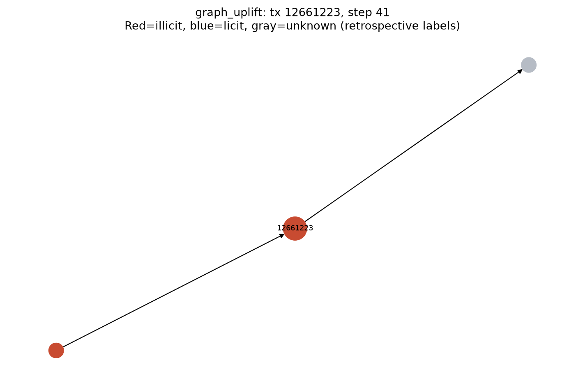
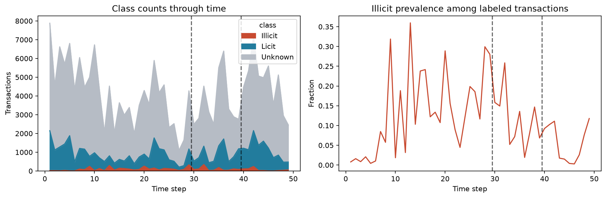
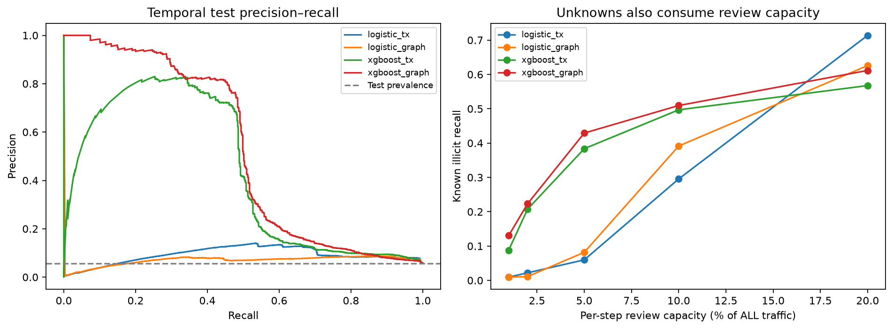
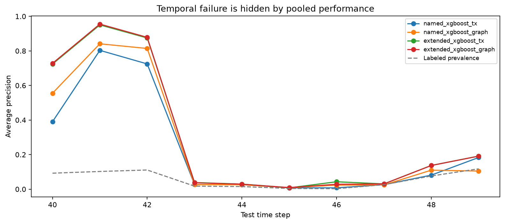

# FraudGraph

**Can a transaction look ordinary on its own but suspicious when you see where its money flows?**

I explored that question using the **[Elliptic++ Bitcoin transaction dataset](https://github.com/git-disl/EllipticPlusPlus)**. FraudGraph compares machine-learning models that look only at individual transaction attributes with models that also look at transaction-to-transaction relationships.

The goal isn't to declare someone guilty or automatically block transactions. It's to investigate whether **network context can help human analysts decide what to review first**—and whether that improvement holds up over time.

<p align="center"></p>

*One selected example: a known-illicit test transaction scored **0.299** using its own attributes and **0.689** after adding graph features. It's a useful illustration, not proof that every transaction improves.*

## What am I actually analyzing?

Bitcoin transactions are public on the blockchain, but an address doesn't automatically identify its real-world owner. Elliptic++ provides a transaction network, attributes and known illicit/licit labels for only some transactions.

Think of two ways to study the same event:

- **A transaction as a row:** its amount, fees, size and other available characteristics.
- **A transaction in a network:** which other transactions it connects to, how connected its neighborhood is and where it sits in the flow.

The dataset contains **203,769 transactions**, connected by **234,355 directed relationships** over **49 time steps**. Most transactions don't have a known label, and I kept them **unknown** instead of treating them as legitimate.

<p align="center"></p>

*Known labels are limited, and the later time periods are reserved for testing rather than randomly mixed into training.*

## What I built

Using **Python, SQL, NetworkX and scikit-learn/XGBoost**, I:

1. Validated the source files, built time-aware graph features and compared **transaction-only** models against **transaction + graph** models.
2. Trained on earlier time steps (1–29), selected models using validation steps (30–39), and evaluated on later steps (40–49).
3. Tested a practical constraint: if analysts can investigate only a small share of traffic, which known illicit transactions make it into their review queue?

Features from future time buckets are excluded from earlier graph snapshots. This is a **batch, end-of-time-bucket experiment**, not a real-time fraud product.

## The results

<p align="center"></p>

| What I tested | What happened |
| --- | --- |
| Add graph features to XGBoost using **15 named transaction attributes** | Average Precision improved from **0.4239 to 0.5240** |
| Add graph features when the model already has **93 additional local attributes** | Average Precision barely moved: **0.6349 to 0.6398** |
| Review the **highest-ranked 5% of all test traffic** with the selected model | Captured **273 of 636 known illicit transactions (42.9%)** |
| Check the primary graph model in **early versus later test periods** | Average Precision fell from **0.7070 to 0.0257** |

*Average Precision summarizes how well known illicit transactions rank above known licit ones across decision thresholds. It isn't classification accuracy or a percentage of money recovered.*

The 5% review simulation counts **unknown-label transactions against analyst capacity**, too. The 42.9% figure is recall **among known illicit test transactions**; the true recall for all illicit traffic cannot be established when so many labels are unknown.

### The finding that changed the story

<p align="center"></p>

Graph information **can** improve a model—but the size of the improvement depends on what transaction information you already have. More importantly, strong pooled results can hide a serious decline in later periods.

The selected graph model's early-versus-late performance makes it inappropriate to claim deployment readiness from this experiment. Shifts in the observed transaction population and changes in the share of known illicit labels also complicate the comparison; the chart doesn't establish the cause of the decline.

**My takeaway:** a model that looks impressive on one test summary isn't necessarily reliable enough to guide real investigations tomorrow.

## Explore the work

This project is an **analytical study**, not a hosted dashboard. The repository contains seven executed notebooks and saved reports, including:

- [Notebooks](notebooks) — the analysis from data exploration to graph features and model evaluation.
- [Model comparisons and visualizations](reports/figures) — including examples of the actual transaction network.
- [Understand and verify FraudGraph](docs/UNDERSTAND_AND_CHECK.md) — a plain-English walkthrough of the methods, checks and limitations.

### Reproduce the analysis

Use **Python 3.12**. The original transaction source files are substantial (about 702 MB), so allow disk space and download time.

```bash
git clone https://github.com/Thizisfranklin/FraudGraph.git
cd FraudGraph
python -m pip install -r requirements.txt
python -m pip install --no-deps -e .
python -m pytest -q
python -m fraudgraph.pipeline --download
python -m fraudgraph.diagnostics
python scripts/build_notebooks.py
python scripts/execute_notebooks.py
python scripts/build_reports.py
python scripts/verify_artifacts.py
```

The original data aren't redistributed here. For exact assumptions and run evidence, see [the leakage audit](reports/LEAKAGE_AUDIT.md), [decision policy](reports/DECISION_FRAMEWORK.md) and [execution notes](reports/EXECUTION_NOTES.md).

**Limitations:** labels are incomplete; risk scores are not calibrated probabilities; model performance changes sharply over time; no customer harm, money recovered or production effectiveness is measured. The network snapshots reflect what's observable at each time-bucket close, not real-time scoring.

**Tools:** Python, pandas, NetworkX, XGBoost, scikit-learn, SQLite, matplotlib, Plotly and pytest.

*Data: Elmougy & Liu (2023), [Elliptic++ authors' repository](https://github.com/git-disl/EllipticPlusPlus). “Illicit” is the dataset's transaction label; it isn't a claim of individual legal guilt.*
